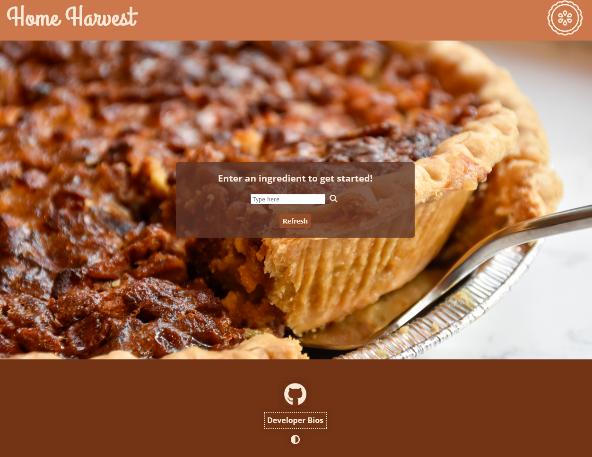

# Project: Home Harvest

## Table of contents

- [Overview](#overview)
- [How to run this Project](#how-to-run-this-project)
- [Acknowledgements](#acknowledgements)

## Overview

## How to run Project

Live Version:
- [Github-Pages](https://chingu-voyages.github.io/v46-tier1-team-07/)

From the repo: 

1) Clone repo

        Git clone https://github.com/chingu-voyages/v46-tier1-team-07.git

2) Go to Project directory

        cd /v46-TIER1-TEAM-07

3) Install npm

        npm install

4) Run locally
        
        

    

## Acknowledgements

### Authors
- [Sarah Thomas](https://github;com/Sarah-Thomas)
- [Amanda Libby](https://github.com/Amanda-Libby)
- [Ganesh Timalsena](https://github.com/gtimalsena)
- [Josh Catlett](https://github.com/xITSDUCKYx)

